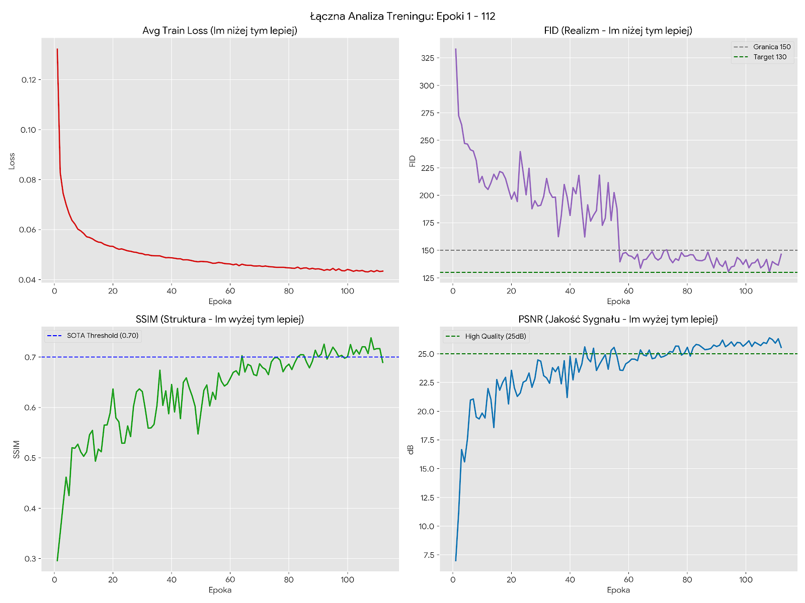
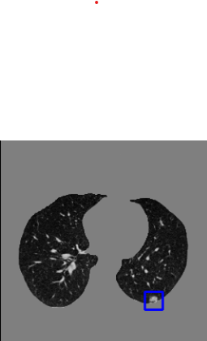
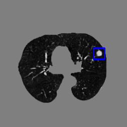
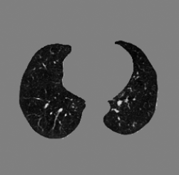

#  EXPERIMENTAL RESULTS AND MODEL EVALUATION

This section presents the performance of the **LIDC-IDRI Diffusion ControlNet** model, designed to generate realistic lung CT scans with controllable nodule characteristics. The data covers the complete training run up to Epoch 112.

---

##  Model Configuration

The final model that produced the best stable results utilized a crucial two-stage fine-tuning strategy to ensure stability and precise convergence.

| Parameter | Value | Notes |
| :--- | :--- | :--- |
| **Architecture** | UNet (Residual Blocks) + ControlNet | |
| **Conditioning** | 6-dim Vector | (x, y, radius, side\_L, side\_R, dist\_pleura) |
| **Resolution** | 256x256 | |
| **Learning Rate (Fine-Tuning)** | `5e-6` | Applied after Epoch 56 for high precision convergence. |
| **Stabilization** | **EMA** ($\beta=0.9999$) | |
| **Dataset** | LIDC-IDRI (2D Slices) | |

---

##  Quantitative Analysis (Best Stable Performance)

| Metric | Best Value | Epoch | Performance Assessment |
| :---: | :---: | :---: | :--- |
| **FID** (↓) | **130.34** | 108 | Target FID < 150 Achieved for the first time!  |
| **SSIM** (↑) | **0.7381** | 108 | above the 0.70 threshold |
| **PSNR** (↑) | **26.38 dB** | 108 |  |

#### Training Progress Summary

---

##  Qualitative Results (Visual Control)

The model demonstrates precise control over nodule placement, size, and adherence to the pleura (chest wall).

#### 1. Precision Control: Distance to Pleura

| 0mm (Attached to Wall) | 3mm (Near Wall) | Healthy Lung (Zero Vector) |
| :---: | :---: | :---: |
|  |  |  |
| *Nodule correctly adheres to the pleura, demonstrating accurate control of the 0mm distance parameter*. | *Nodule is accurately separated from the pleura, demonstrating clear control over the intermediate distance*. | *Zero-vector input yields a healthy lung with correct texture and no mass*. |

---

### Conclusion

The implemented **Diffusion + ControlNet** pipeline successfully achieved its primary goal: generating synthetic lung CT slices with structural integrity and controllable pathology.
