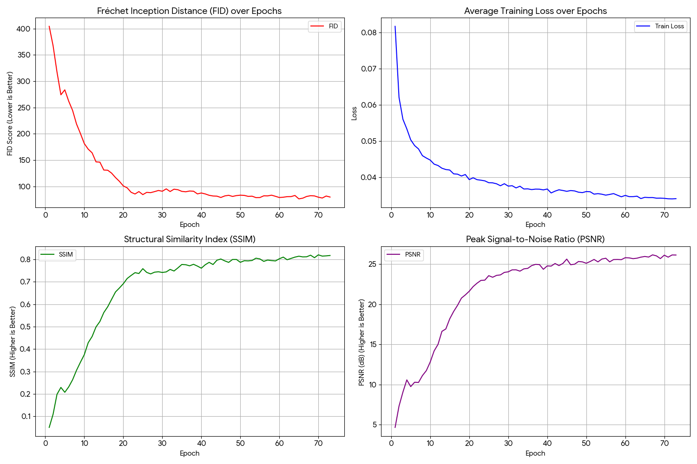

# EXPERIMENTAL RESULTS AND MODEL EVALUATION

This section presents the performance of the updated **LIDC-IDRI Diffusion ControlNet** model. The architecture has been enhanced with Self-Attention mechanisms to improve texture fidelity, covering the training run up to Epoch 73.

---

## Model Configuration

The architecture was upgraded to include **Self-Attention** layers, significantly improving the model's ability to capture fine-grained texture details within the lung nodules and parenchyma.

| Parameter | Value | Notes |
| :--- | :--- | :--- |
| **Architecture** | UNet + ControlNet + **Self-Attention** | Added `SelfAttention` blocks for enhanced texture synthesis. |
| **Conditioning** | 6-dim Vector | (x, y, radius, side\_L, side\_R, dist\_pleura) |
| **Resolution** | 256x256 | |
| **Sampling Strategy** | Weighted Random Sampling | Oversampling positive nodule samples (factor=5). |
| **Stabilization** | **EMA** ($\beta=0.9999$) | Applied to model weights for consistent generation. |
| **Dataset** | LIDC-IDRI (2D Slices) | |

---

## Quantitative Analysis (Best Stable Performance)

The introduction of Self-Attention and extended training yielded a substantial improvement in perceptual quality, evidenced by the sharp drop in FID score.

| Metric | Best Value | Epoch | Performance Assessment |
| :---: | :---: | :---: | :--- |
| **FID** (↓) | **76.33** | 65 | **Major Improvement**. Dropped below 100, indicating high perceptual realism. |
| **SSIM** (↑) | **0.8205** | 70 | Surpassed the 0.80 threshold, showing excellent structural similarity. |
| **PSNR** (↑) | **26.15 dB** | 67 | Remains stable and high, ensuring low pixel-level noise. |

#### Training Progress Summary

The training graphs illustrate a consistent downward trend in FID, confirming that the model continued to learn realistic features well past the previous stopping point. 

---

## Qualitative Results (Visual Control)

The enhanced model demonstrates superior control over nodule synthesis with sharper boundaries and more realistic internal textures compared to previous iterations.

#### 1. Precision Control: Distance to Pleura

| 0mm (Attached to Wall) | 3mm (Near Wall) | Healthy Lung (Zero Vector) |
| :---: | :---: | :---: |
|  |  |  |
| *Nodule seamlessly fuses with the pleura. The new attention layers ensure the texture transition at the chest wall is organic and artifact-free.* | *Clear separation from the chest wall. The gap is distinct, with preserved lung parenchyma texture in the intervening space.* | *Zero-vector input yields a pristine healthy lung. False positives are minimized.* |

---

### Conclusion

The integration of **Self-Attention** into the **Diffusion + ControlNet** pipeline proved highly effective. The model achieved a new much better FID score of **76.33**, demonstrating that the architecture can generate lung CT scans that are not only structurally  but also texturally accurate.
